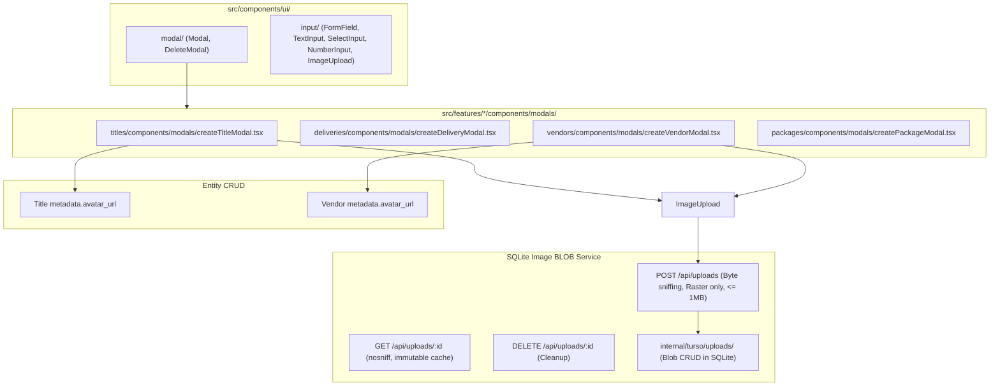

# Implementation Plan — Entity Modals, Shared Delete Modal, Hardened SQLite Image Storage (1MB Cap) & Centered Layouts

This revised plan incorporates the findings from `.agents/reviews/11-modals-plan/20260824T120000Z.md`:
- Security hardening (SVG elimination, server-side byte sniffing via `http.DetectContentType`, `nosniff` headers).
- Upload lifecycle (`DELETE /api/uploads/:id` and cleanup).
- Swaggo contract annotations + SDK codegen.
- Automated 1MB boundary test suite.
- Feature modals co-located in `src/features/*/components/modals/`.
- Shared `<DeleteModal />` and centered empty states.

---

## 1. Goal Description

1. **Feature Modals Directory Structure**: Consolidate modals under `src/features/<feature>/components/modals/` so each feature can host multiple modal types (e.g. creation, edit, inspect) in one co-located place.
2. **Shared Delete Modal**: Build a reusable, accessible `<DeleteModal />` in `src/components/ui/modal/` for confirming destructive actions with safety warnings, entity ID display, and loading feedback across any entity.
3. **Hardened SQLite BLOB Image Storage & Upload API (Strict 1MB Limit)**:
   - Create an `Upload` table in Turso/SQLite storing raw binary image BLOBs (`data []byte`, `mime_type`, `size_bytes`, `filename`).
   - Implement `POST /api/uploads` (multipart upload with strict 1MB cap, byte sniffing via `http.DetectContentType`, raster images only).
   - Implement `GET /api/uploads/:id` (streams binary image with `X-Content-Type-Options: nosniff`, `Content-Security-Policy: default-src 'none'`, and HTTP caching).
   - Implement `DELETE /api/uploads/:id` for lifecycle cleanup.
   - Store the resulting `/api/uploads/:id` URL inside the entity's existing `metadata` map uniformly as **`avatar_url`** (`metadata.avatar_url`) across all entities.
4. **Image Upload UI Component**: Build a clean `<ImageUpload />` primitive in `src/components/ui/input/` with client-side 1MB validation and drag-and-drop preview.
5. **Centered Empty States & Modals**: Ensure all empty states and modal overlays are strictly centered on both the X and Y axes across all viewport sizes.

---

## 2. Architecture & Security Invariants



### Security & Invariant Rules
1. **No SVG / Safe Raster Formats Only**:
   - Only `image/png`, `image/jpeg`, `image/webp`, and `image/gif` are accepted. SVG is strictly prohibited to eliminate stored XSS vectors.
2. **Server-Side Content Sniffing**:
   - `http.DetectContentType` on the first 512 bytes is used to verify the actual file payload. Client-provided `Content-Type` headers are never trusted blindly.
3. **Hardened Headers**:
   - `GET /api/uploads/:id` sets `X-Content-Type-Options: nosniff` and `Content-Security-Policy: default-src 'none'`.
4. **Strict 1MB Max File Size**:
   - `internal/api/uploads`: File payloads > 1MB (`1048576` bytes) are immediately rejected with `400 Bad Request`.
   - `web/src/components/ui/input/imageUpload.tsx`: Client-side validation blocks uploads > 1MB before sending requests over the wire.
5. **Uniform Naming**:
   - The image URL is consistently stored under `metadata: { avatar_url: "/api/uploads/..." }` across all entities.
6. **Strict `camelCase` Naming & Deep Co-Location**:
   - All frontend files and directories follow camelCase (`createTitleModal.tsx`, `deleteModal.tsx`, `imageUpload.tsx`).
   - Every directory contains a clean `index.ts` barrel.

---

## 3. Proposed Changes

### Backend: SQLite Uploads & Image BLOB Storage

#### [NEW] `internal/turso/ent/schema/upload.go`
- Fields:
  - `id`: string (e.g. `upload-01j7abc...`)
  - `filename`: string
  - `mime_type`: string (`image/png`, `image/jpeg`, `image/webp`, `image/gif`)
  - `data`: `field.Bytes("data")` (raw binary blob)
  - `size_bytes`: `field.Int64("size_bytes")`
  - `created_at`: `field.Time("created_at").Default(time.Now)`

#### [NEW] `internal/turso/uploads/create.go` & `get.go` & `delete.go` & `uploads_test.go`
- Functional actions:
  - `uploads.Create(ctx, client, upload)`
  - `uploads.Get(ctx, client, id)`
  - `uploads.Delete(ctx, client, id)`

#### [NEW] `internal/api/uploads/routes.go` & `upload.go` & `get.go` & `delete.go` & `uploads_test.go`
- Swaggo annotations on all endpoints.
- `MaxUploadSizeBytes = 1 * 1024 * 1024` (1MB cap).
- `POST /api/uploads`: Parses multipart form, checks size <= 1MB, sniffs bytes with `http.DetectContentType`, persists in SQLite, returns `{ id, url: "/api/uploads/{id}", mime_type, size_bytes, filename }`.
- `GET /api/uploads/:id`: Streams binary image with `Content-Type`, `Content-Length`, `X-Content-Type-Options: nosniff`, and `Cache-Control: public, max-age=31536000, immutable`.
- `DELETE /api/uploads/:id`: Removes binary blob from SQLite.
- `uploads_test.go`: Automated tests for exact boundary (1048576 bytes pass, 1048577 bytes fail with 400), non-image rejection (e.g. text/html with fake PNG extension), and SVG rejection.

#### [MODIFY] `internal/api/server.go`
- Mount `uploads.RegisterRoutes(apiGroup.Group("/uploads"), s.client)`.

#### [MODIFY] `openapi/swagger.json` & `web/src/lib/api/generated/`
- Run `go generate ./openapi/...` and `bun run generate:api`.

---

### Frontend: UI Primitives & Delete Modal

#### [NEW] `web/src/components/ui/modal/modal.css.ts` & `modal.tsx`
- **Centered Layout**:
  - `backdrop`: `position: fixed; inset: 0; display: flex; align-items: center; justify-content: center; z-index: 1000; min-height: 100vh; padding: vars.space.lg;`
  - `modalContainer`: Vertically and horizontally centered on viewport.
  - Keyboard `Escape` and outside click listeners.

#### [NEW] `web/src/components/ui/modal/deleteModal.css.ts` & `deleteModal.tsx` & `index.ts`
- Shared destructive confirmation dialog:
  - Props: `isOpen`, `onClose`, `onConfirm`, `title`, `entityName`, `entityId`, `isDeleting`, `warningText`.
  - Danger highlight badge, clear warning text, Cancel & Delete action buttons with spinner.

#### [NEW] `web/src/components/ui/input/input.css.ts` & `input.tsx` & `imageUpload.tsx` & `index.ts`
- Form fields: `FormField`, `TextInput`, `SelectInput`, `NumberInput`.
- `ImageUpload`:
  - Enforces `1MB` max file size check on select.
  - Accepts raster images only (`image/png,image/jpeg,image/webp,image/gif`).
  - Drag-and-drop or click-to-browse file selector.
  - Image thumbnail preview with remove button.
  - Uploads to `POST /api/uploads` and emits `onUploadComplete(url: string)`.

---

### Feature Modals (`src/features/*/components/modals/`)

#### [NEW] `web/src/features/titles/components/modals/createTitleModal.tsx` & `modals.css.ts` & `index.ts`
- Fields: Title Name, ID slug, Type (`FEATURE`/`SERIES`/`SPECIAL`), Premiere Date, Territories count, Master version (`V01`), and optional `<ImageUpload />` (stored in `metadata.avatar_url`).
- On submit: calls `postTitles`, invalidates `titlesKeys.all`, shows success toast.

#### [NEW] `web/src/features/deliveries/components/modals/createDeliveryModal.tsx` & `modals.css.ts` & `index.ts`
- Fields: Title ID selector (from active titles), Country territory code (with quick chips), Target Date, Status (`PENDING`/`READY_TO_SHIP`/`HOLD`).
- On submit: calls `postDeliveries`, invalidates `deliveriesKeys.all`, shows success toast.

#### [NEW] `web/src/features/vendors/components/modals/createVendorModal.tsx` & `modals.css.ts` & `index.ts`
- Fields: Facility Name, ID slug, Specialty selector (`AUDIO_DUBBING`, `SUBTITLES`, `QC_LAB`, `METADATA`, `MASTERING`), and optional Logo `<ImageUpload />` (stored in `metadata.avatar_url`).
- On submit: calls `postVendors`, invalidates `vendorsKeys.all`, shows success toast.

#### [NEW] `web/src/features/packages/components/modals/createPackageModal.tsx` & `modals.css.ts` & `index.ts`
- Fields: Title ID selector, Vendor ID selector, Component (`VIDEO`/`AUDIO`/`SUBTITLE`/`METADATA`), Language locale tag, Version, Derived Master Version (`V01`), Status.
- On submit: calls `postPackages`, invalidates `packagesKeys.all`, shows success toast.

---

### Route Wiring & Centered Empty State Fixes

#### [MODIFY] `web/src/routes/-titles.css.ts`, `-deliveries.css.ts`, `-vendors.css.ts`, `-runs.css.ts`
- Fix `.emptyState`:
  ```ts
  export const emptyState = style({
    display: 'flex',
    flexDirection: 'column',
    alignItems: 'center',
    justifyContent: 'center',
    textAlign: 'center',
    minHeight: '380px',
    padding: vars.space['2xl'],
    gap: vars.space.sm,
    color: vars.color.textSecondary,
  })
  ```

#### [MODIFY] `web/src/routes/titles.tsx`, `deliveries.tsx`, `vendors.tsx`, `runs.tsx`
- Render image thumbnail when `metadata.avatar_url` is present, with fallback icon thumbnail when absent.
- Wire "New ..." buttons to open respective creation modals.
- Wire item delete actions to trigger the shared `<DeleteModal />`.

---

## 4. Verification Plan

### Automated Tests
1. **Backend Uploads & Boundary Tests**:
   ```bash
   go test -v -race ./internal/turso/uploads/... ./internal/api/uploads/...
   ```
   *Asserts 1048576 bytes pass, 1048577 bytes fail with 400, HTML/SVG rejected, content sniffing validated.*
2. **Frontend Quality & Tests**:
   ```bash
   cd web && bun run lint && bun run typecheck && bun test
   ```
3. **Full Invariant Verification Script**:
   ```bash
   ./.agents/scripts/verify.sh
   ```

### Manual & Interactive Verification
1. Attempt uploading a 2MB image; verify client and backend reject with 1MB limit error.
2. Upload a valid 500KB PNG/WebP in Create Title Modal; verify `/api/uploads/:id` returns image and title row renders the thumbnail.
3. Open Title, Vendor, Delivery, and Run pages with 0 items; verify empty states are vertically and horizontally centered.
4. Click Delete on an entity; verify `<DeleteModal />` opens centered, confirms deletion, and updates list.
