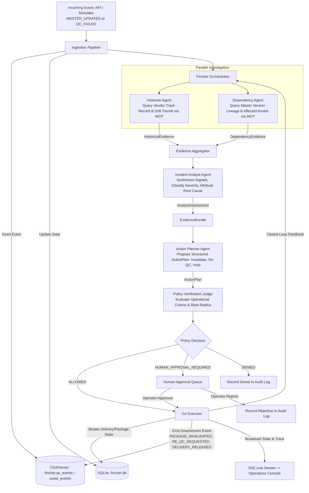
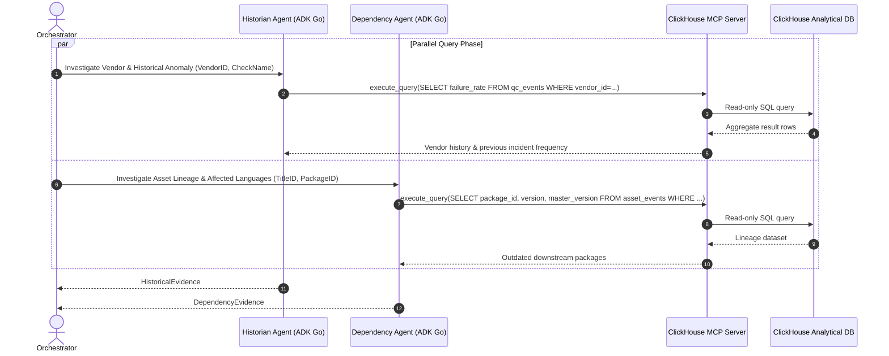

# Fincher Agentic Workflow & Closed-Loop Architecture

This document diagrams the complete multi-agent workflow, from production event trigger to policy gating, software execution, and closed-loop re-evaluation.

---

## Complete Multi-Agent Workflow

---

## Sub-Agent Query Contracts (ClickHouse MCP)

