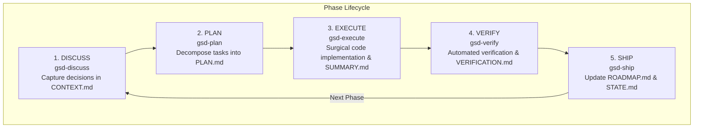

# GSD Core — Phase Loop Workflow

This document illustrates the 5-step GSD Core development lifecycle:

---

## Artifact Mapping

| Stage | Input Artifacts | Output Artifact | Key Responsibility |
| :--- | :--- | :--- | :--- |
| **Discuss** | `PROJECT.md`, `REQUIREMENTS.md` | `phases/XX/CONTEXT.md` | Align on intent, choices, and architectural boundaries. |
| **Plan** | `CONTEXT.md`, `REQUIREMENTS.md` | `phases/XX/PLAN.md` | Break work into atomic, verifiable tasks. |
| **Execute** | `PLAN.md` | `phases/XX/SUMMARY.md` | Implement code and unit tests with fresh context. |
| **Verify** | Code, `PLAN.md` | `phases/XX/VERIFICATION.md` | Run compilation, vet, race tests, and diagnostics. |
| **Ship** | `VERIFICATION.md` | Updated `ROADMAP.md` & `STATE.md` | Archive phase and advance active milestone pointer. |
