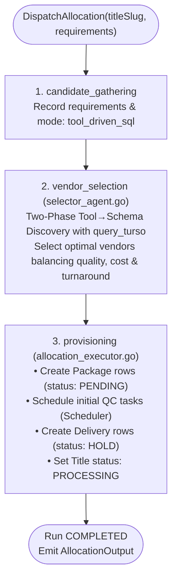
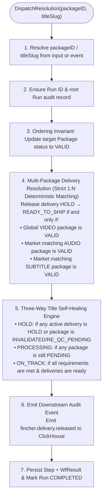
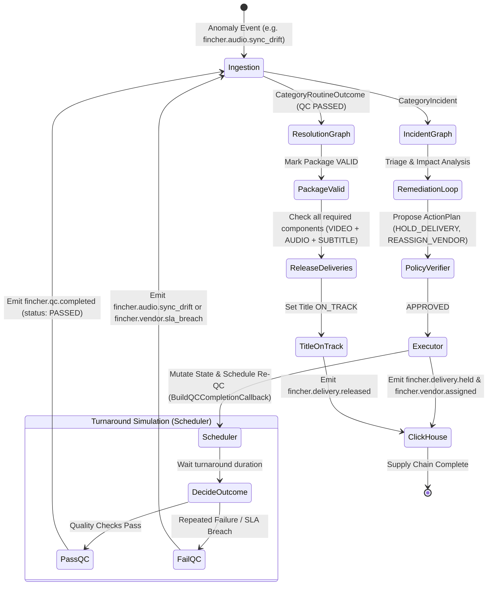

# 🎬 Fincher

**Autonomous Delivery-Integrity Operations Engine for Media Post-Production**

Fincher is an event-driven, multi-agent operations engine built for global film and television streaming pipelines. It intercepts production anomalies (audio sync drift, master cut revisions, vendor SLA breaches, corrupted QC packages), autonomously investigates root causes and historical context using **Google Gemini 2.5** and the **official ClickHouse Model Context Protocol (MCP)**, synthesizes remediation plans, runs them through a **deterministic Policy Verification Judge**, executes transactional state mutations in Go, and drives the entire supply chain to resolution in a self-healing closed loop.

---

## 🚀 Quick Start (Up & Running in 2 Minutes)

### Prerequisites
* **Go 1.24+**
* **Docker & Docker Compose**
* **Bun** (for frontend development)
* **Just** (optional, recommended task runner)
* **Google Gemini API Key**

---

### 1. Clone & Configure Environment

```bash
git clone https://github.com/elliot14A/fincher.git
cd fincher

# Copy environment template
cp .env.example .env
```

Edit `.env` and add your Google Gemini API key:
```dotenv
FINCHER_PORT=8080
FINCHER_ENV=development
FINCHER_STEP_TIMEOUT=30s
FINCHER_TURSO_URL=fincher.db
FINCHER_MCP_URL=http://127.0.0.1:8000/mcp
FINCHER_GEMINI_API_KEY=your_gemini_api_key_here
FINCHER_GEMINI_MODEL=gemini-2.5-flash
FINCHER_GEMINI_OPTIONS=location=asia-south1
FINCHER_DAILY_MODEL_CAP=200
```

---

### 2. Start Infrastructure (ClickHouse & ClickHouse MCP)

Launch ClickHouse analytical DB and the official ClickHouse MCP server:

```bash
# Using Just:
just docker-up

# Or using Docker Compose directly:
docker compose up -d
```

Verify health:
* ClickHouse HTTP: `http://localhost:8123/ping`
* ClickHouse MCP Health: `http://localhost:8000/health`

---

### 3. Seed Database & Historical Analytics

Populate SQLite with media catalog titles, masters, packages, deliveries, and active vendors, and inject synthetic historical QC logs and defect metrics into ClickHouse:

```bash
# Using Just:
just seed

# Or using Go directly:
go run ./cmd/seed
```

*(To perform a clean wipe and re-seed, run `just seed-reset` or `go run ./cmd/seed --reset`)*.

---

### 4. Run Fincher (Development Mode)

Start both the Go backend (port `8080`) and Preact frontend (port `5173`) with live-reload:

```bash
# Using Just:
just dev

# Or run separately in two terminals:
# Terminal 1 (Backend):
go run ./cmd/fincher

# Terminal 2 (Frontend):
cd web && bun install && bun run dev
```

* 🖥️ **Operations Console UI**: [`http://localhost:5173`](http://localhost:5173) (proxies `/api` to Go backend)
* ⚡ **Backend API & Health**: [`http://localhost:8080/health`](http://localhost:8080/health)
* 📜 **OpenAPI 3 Specification**: [`http://localhost:8080/openapi.json`](http://localhost:8080/openapi.json)

---

## ⚡ Core Philosophy & Invariants

> **"AI investigates and plans. Scoped judges verify. Software executes."**

* **Invariant 1 — Single Source of Mutation**: All AI agents are strictly read-only. Agents inspect SQLite via [`query_turso`](file:///home/kiwi/Desktop/hackathons/fincher/internal/agent/tools/turso.go) and ClickHouse historical analytical data via [`query_clickhouse`](file:///home/kiwi/Desktop/hackathons/fincher/internal/agent/tools/clickhouse.go) through MCP. Agents **never** write SQL or mutate production state directly. All mutations flow exclusively through the Go executor engine ([`runner.go`](file:///home/kiwi/Desktop/hackathons/fincher/internal/agent/runner.go)) and deterministic resolution engine.
* **Invariant 2 — Policy-Gated Execution**: No action is ever executed without passing the [Policy Verification Judge](file:///home/kiwi/Desktop/hackathons/fincher/internal/agent/verifier.go). If a plan violates market-isolation rules, exceeds turnaround buffers, or assigns low-accuracy vendors, the judge rejects it with actionable feedback in a bounded 3-attempt self-correction loop.
* **Invariant 3 — Closed-Loop Autonomous Progression**: Every software action emits a downstream CloudEvent (e.g. `fincher.vendor.assigned` -> triggers re-QC -> `fincher.qc.completed` -> triggers Resolution -> releases deliveries -> title `ON_TRACK`). Fincher listens to its own emitted events to drive workflows to completion without human babysitting.
* **Invariant 4 — Full Auditability & Live Telemetry**: Every run, agent tool call, reasoning rationale, and judge verdict is written to SQLite (`runs`, `steps`, `wf_results`) and streamed live to the Preact UI console via Server-Sent Events (SSE).

---

## 🏗️ System Architecture & Services

Fincher integrates a modern high-performance Go backend with real-time analytical and operational databases, the Model Context Protocol, and an ultra-fast frontend.

```mermaid
flowchart TD
    subgraph Ingestion ["1. Event Ingestion Layer"]
        EV["Incoming CloudEvents<br/>(API / Simulator / Scheduled Re-QC)"] --> ROUTER["IngestAndRoute()<br/>internal/api/events/create.go"]
        ROUTER -->|Persist Event| CH_INGEST[("ClickHouse events")]
    end

    subgraph Dispatch ["2. Idempotent Dispatcher (dispatch.go)"]
        ROUTER -->|CategoryIncident| WFA["DispatchIncident<br/>(Workflow A: Incident Graph)"]
        ROUTER -->|CategoryAllocation| WFB["DispatchAllocation<br/>(Workflow B: Allocation Graph)"]
        ROUTER -->|CategoryRoutineOutcome + QC PASSED| WFC["DispatchResolution<br/>(Workflow C: Resolution Graph)"]
    end

    subgraph Agents ["3. Multi-Agent Reasoning & MCP Tool Runtime"]
        WFA --> TRIAGE["Triage / Filter Judge<br/>(Gemini 2.5)"]
        TRIAGE --> GATHER["Context Gathering<br/>(Deterministic Pre-Fetch)"]
        GATHER --> PLANNER["Action Planner<br/>(Two-Phase ADK Tool Loop)"]
        PLANNER <-->|Read-Only Tools| TOOLS["Agent Tools<br/>• query_turso<br/>• query_clickhouse (MCP)<br/>• query_analytics<br/>• get_delivery_impact<br/>• get_vendor_candidates<br/>• get_title_ready_projection"]
        TOOLS <-->|MCP HTTP (:8000)| MCP_SVC["ClickHouse MCP Server"]
        MCP_SVC <-->|SQL| CH_DB[("ClickHouse DB<br/>(:8123 / :9000)")]
        TOOLS <-->|Read-Only SQL| SQLITE_DB[("Turso / SQLite<br/>(fincher.db)")]
    end

    subgraph PolicyGate ["4. Bounded Policy Verification Loop"]
        PLANNER --> VERIFIER{"Policy Verification Judge<br/>(verifier.go)<br/>Deterministic Rules Engine"}
        VERIFIER -->|REJECTED (Attempt < 3)| PLANNER
        VERIFIER -->|ESCALATE (Attempt >= 3)| ESCALATED["Escalate to Human Ops<br/>RunStatusEscalated"]
        VERIFIER -->|APPROVED| EXEC["Go Mutation Executor<br/>(runner.go)"]
    end

    subgraph Execution ["5. Execution & Closed-Loop Feedback"]
        EXEC -->|Mutate Packages / Deliveries / Titles| SQLITE_DB
        EXEC -->|Schedule Re-QC Task| SCHED["Scheduler (internal/scheduler)"]
        EXEC -->|Emit Downstream Events| CH_INGEST
        SCHED -->|Turnaround Elapsed| QC_CB["QC Outcome Decision<br/>(BuildQCCompletionCallback)"]
        QC_CB -->|Emit QC PASSED / Defect Event| EV
        WFC -->|Deterministic Release & Self-Heal| SQLITE_DB
        WFC -->|Emit fincher.delivery.released| CH_INGEST
    end

    subgraph UI ["6. Real-Time Operations Console"]
        SQLITE_DB --> SSE["SSE Stream /api/events/stream"]
        SSE --> WEB["Preact Operations Console<br/>(:5173 / embedded :8080)"]
    end
```

### Services Breakdown

| Service / Component | Technology / Docker Image | Role & Responsibility |
| :--- | :--- | :--- |
| **Backend Orchestrator** | **Go 1.24+** (`labstack/echo/v4`) | REST API (`/api/*`), OpenAPI 3 spec serving (`/openapi.json`), SSE event streaming, agent coordination, and transactional mutations. |
| **Historical Analytics DB** | **ClickHouse 24.3** (`clickhouse/clickhouse-server:24.3-alpine`) | Stores historical CloudEvents (`events`), materialized QC inspection records (`qc`), and rolling vendor defect metrics (`vendor_metrics` SummingMergeTree). |
| **ClickHouse MCP Server** | **MCP ClickHouse** (`ghcr.io/clickhouse/mcp-clickhouse:latest`) | Official Model Context Protocol HTTP interface exposing read-only analytical query tools to Google ADK agents on port `8000`. |
| **Operational State DB** | **Turso / SQLite** (`mattn/go-sqlite3` + `ent` ORM) | High-performance operational state in WAL mode: titles, masters, media packages, deliveries, vendors, and audit runs/steps/wf_results. |
| **Agent Reasoning Model** | **Google Gemini 2.5 Flash** (`google.golang.org/adk/v2`) | Fast, structured multi-agent reasoning, triage filtering, remediation action planning, vendor allocation, and operations Q&A chat. |
| **In-Memory Task Scheduler** | **Fincher Scheduler** ([`internal/scheduler/`](file:///home/kiwi/Desktop/hackathons/fincher/internal/scheduler)) | Manages time-compressed simulated QC turnaround tasks and triggers automated completion callbacks. |
| **Operations Console** | **Preact + Vite + Vanilla Extract** ([`web/`](file:///home/kiwi/Desktop/hackathons/fincher/web)) | Ultra-fast ~3kb client UI with TanStack Router, TanStack Query, TanStack DB, TanStack Table, Lucide icons, and @xyflow/react interactive lineage DAG. |

---

## 🤖 Agent Orchestration Graphs

All three execution graphs live in [`internal/agent/graph/`](file:///home/kiwi/Desktop/hackathons/fincher/internal/agent/graph/) and are fronted by idempotent async dispatchers in [`dispatch.go`](file:///home/kiwi/Desktop/hackathons/fincher/internal/agent/graph/dispatch.go):
1. Derives a deterministic `runID` (`run-<event.ID>` or `run-<uuid8>`).
2. Persists a root `Run` record with status `RUNNING` (short-circuiting duplicate executions).
3. Launches the graph inside a panic-protected goroutine (`recovery.SafeGo`) with a 5-minute `context.WithTimeout`.
4. Persists granular `Step` and `WfResult` audit records for real-time telemetry.

---

### Workflow A: INCIDENT Graph ([`incident.go`](file:///home/kiwi/Desktop/hackathons/fincher/internal/agent/graph/incident.go))

Triggered when an ingested event indicates an anomaly: audio sync drift (`fincher.audio.sync_drift`), revised master cuts (`fincher.master.cut.revised`), vendor SLA breaches (`fincher.vendor.sla_breach`), invalidated packages (`fincher.package.invalidated`), title deadline warnings (`fincher.title.deadline_reached`), or failed QC inspections (`fincher.qc.completed` with `FAILED` or `WARNING`).

```mermaid
sequenceDiagram
    autonumber
    actor Ev as Ingested Event
    participant G as Incident Graph
    participant F as Triage Judge (Gemini)
    participant MR as Master Revision Handler
    participant CG as Context Gathering
    participant P as Action Planner (Gemini)
    participant V as Policy Verifier (Deterministic)
    participant E as Go Executor (Runner)
    participant S as Scheduler & ClickHouse

    Ev->>G: DispatchIncident(event)
    G->>F: 1. triage_judge: FilterEvent(event)
    alt Event not actionable
        F-->>G: Actionable=false
        G-->>G: Mark Run COMPLETED (No-op)
    else Event actionable
        opt Master Cut Revision Event
            G->>MR: 1a. applyMasterRevision(): Invalidate stale downstream packages
        end
        G->>CG: 2. context_gathering: FetchDeliveryImpact, FetchAnalytics, GetTitleReadyProjection
        loop Remediation Self-Correction Loop (Max 3 attempts)
            G->>P: 3. PlanRemediationViaTools (ADK Tool+Schema)
            P-->>G: Proposed ActionPlan
            G->>V: VerifyPlan(plan, impact, projection, attempt)
            alt Decision == APPROVED
                V-->>G: APPROVED
                G->>E: 4. remediation_executor: RunActionPlanWithDeps(finalPlan)
                E->>S: Mutate SQLite, Schedule Re-QC, Emit Downstream Events
                G-->>G: Run COMPLETED
            else Decision == REJECTED (attempts < 3)
                V-->>G: REJECTED (with policy rationale)
                Note over G,P: Inject rejection rationale into next planner prompt
            else Decision == ESCALATE (attempts >= 3)
                V-->>G: ESCALATE (retry cap reached)
                G-->>G: Run ESCALATED (Notify human operator; no state mutations)
            end
        end
    end
```

---

### Workflow B: ALLOCATION Graph ([`allocation.go`](file:///home/kiwi/Desktop/hackathons/fincher/internal/agent/graph/allocation.go))

Triggered when new assets or localized versions are required (`fincher.package.required`, `fincher.vendor.reconform.dispatched`, or title onboarding).



---

### Workflow C: RESOLUTION Graph ([`resolution.go`](file:///home/kiwi/Desktop/hackathons/fincher/internal/agent/graph/resolution.go))

A **100% deterministic, non-LLM self-healing workflow** triggered when a re-QC task passes (`fincher.qc.completed` with `status: "PASSED"`).



---

## 🛠️ The 6 Agent Tools ([`internal/agent/tools/`](file:///home/kiwi/Desktop/hackathons/fincher/internal/agent/tools/))

Fincher equips its sub-agents with 6 purpose-built tools. Two tools provide direct, guardrailed SQL access, and four provide structured analytical calculations.

| Tool Name | Type & Constructor | Input Arguments | Functionality & Guardrails |
| :--- | :--- | :--- | :--- |
| **`query_turso`** | SQL Tool<br/>[`NewTursoQueryTool`](file:///home/kiwi/Desktop/hackathons/fincher/internal/agent/tools/turso.go) | `sql`: `string` | Read-only SQL query engine against operational SQLite (`vendors`, `media_packages`, `deliveries`, `titles`, `masters`, `runs`, `steps`, `wf_results`).<br/>*Guardrails*: Strict regex prohibits writes/DDL (`INSERT`, `UPDATE`, `DELETE`, etc.), disallows multi-statements, auto-wraps queries in `LIMIT 100`, caps bytes at 24KB. |
| **`query_clickhouse`** | MCP Tool<br/>[`NewClickhouseQueryTool`](file:///home/kiwi/Desktop/hackathons/fincher/internal/agent/tools/clickhouse.go) | `sql`: `string` | Read-only analytical SQL against ClickHouse historical logs (`events`, `qc`, `vendor_metrics`) via the official ClickHouse MCP HTTP interface.<br/>*Guardrails*: Pinned read-only transport, auto-enforces `LIMIT 100`, bounded output formatting. |
| **`query_analytics`** | Typed ADK Tool<br/>[`NewAnalyticsTool`](file:///home/kiwi/Desktop/hackathons/fincher/internal/agent/tools/analytics.go) | `vendor_id`, `title_slug`, `component` | Queries ClickHouse through MCP to compute recency-weighted vendor accuracy, defect counts, prior incident counts, and relevant inspection logs. |
| **`get_delivery_impact`** | Typed ADK Tool<br/>[`NewDeliveryImpactTool`](file:///home/kiwi/Desktop/hackathons/fincher/internal/agent/tools/impact.go) | `package_id`, `title_id?`, `hours_until_premiere?` | Calculates the blast radius of an asset defect: affected media packages, downstream deliveries mapped by territory/language, affected markets, and launch urgency (`IsPremiereUrgent` ≤ 72h). |
| **`get_vendor_candidates`** | Typed ADK Tool<br/>[`NewVendorCandidatesTool`](file:///home/kiwi/Desktop/hackathons/fincher/internal/agent/tools/vendors.go) | `component?`, `market?` | Filters qualified active vendors capable of handling a given component and market (e.g. `AUDIO` for `de-DE`, global `VIDEO`), enriched with historical accuracy stats from ClickHouse. |
| **`get_title_ready_projection`** | Typed ADK Tool<br/>[`NewProjectionTool`](file:///home/kiwi/Desktop/hackathons/fincher/internal/agent/tools/projection.go) | `title_slug` | Projects delivery feasibility: computes hours until premiere, critical remaining repair hours (master reconform 48h + parallel vendor turnaround), buffer hours, and risk band (`SAFE`, `WATCH`, `TIGHT`, `BREACH`). |

---

## 🔁 The Closed-Loop Event Lifecycle

Fincher's core differentiator is its **re-entrant closed loop** ([`internal/api/events/create.go`](file:///home/kiwi/Desktop/hackathons/fincher/internal/api/events/create.go)). Workflows do not terminate in static reports—they execute fixes, simulate turnaround, and trigger their own follow-up resolutions until the title is ready to air.



---

## 🚦 Policy Verification Rules Engine ([`verifier.go`](file:///home/kiwi/Desktop/hackathons/fincher/internal/agent/verifier.go))

Before any action plan can touch the database or trigger vendors, the Policy Verification Judge evaluates it against deterministic operational rules:

1. **Anti-Hallucination & Target Integrity**: Rejects empty plans, missing target IDs, or delivery actions targeting package IDs (`pkg-*`).
2. **Contradiction Guard**: Prohibits simultaneous `HOLD_DELIVERY` and `RELEASE_DELIVERY` on the same delivery.
3. **Market Isolation**: Ensures remediation actions only affect the specific language/territory impacted by the defect without collateral delivery holds in unrelated markets.
4. **Defect-Free Release Gate**: Delivery cannot be released if any associated component package remains in `INVALIDATED` or `RE_QC_PENDING` status.
5. **Vendor Accuracy Floor**: Prohibits assigning any vendor with a historical accuracy rating below **90%** (`VendorAccuracyFloor = 0.90`).
6. **Launch Countdown & Turnaround Feasibility**: If vendor turnaround exceeds the time remaining until premiere without a `HOLD_TITLE` or `NOTIFY_STAKEHOLDERS` action, the plan is rejected.
7. **Social Media Guardrail**: Prohibits public stakeholder/social alerts if premiere is more than 72 hours away (`SocialNoticeThresholdHours = 72h`) or if no deliveries are currently held.
8. **Unremediated Package Check**: Every defective package identified in the blast radius must have an explicit `REASSIGN_VENDOR` action.
9. **Bounded Self-Correction**: If the plan fails verification 3 times (`MaxRemediationAttempts = 3`), the loop breaks immediately and escalates to `RunStatusEscalated` without applying any state changes.

---

## 🧪 Testing & Simulating Anomalies

You can test Fincher's multi-agent workflows directly from the **Simulate UI tab** ([`web/src/routes/simulate.tsx`](file:///home/kiwi/Desktop/hackathons/fincher/web/src/routes/simulate.tsx)) or by posting CloudEvents to `/api/events`:

### Scenario 1: Audio Sync Drift Incident
Post an audio sync anomaly event to trigger **Workflow A (Incident)**:
```bash
curl -X POST http://localhost:8080/api/events \
  -H "Content-Type: application/json" \
  -d '{
    "type": "fincher.audio.sync_drift",
    "source": "qc.audio.analyzer",
    "subject": "solaris-2026",
    "severity": "WARN",
    "data": {
      "package_id": "pkg-solaris-de-audio",
      "title_slug": "solaris-2026",
      "component": "AUDIO",
      "language": "de-DE",
      "sync_drift_ms": 135.0,
      "vendor_id": "vnd-berlin-sound"
    }
  }'
```
* **Expected Outcome**: Triage Judge flags severity -> Blast radius identifies German delivery hold -> Action Planner queries vendor candidates via MCP -> Policy Verifier approves reassignment -> Executor mutates SQLite -> Scheduler initiates re-QC -> Resolution engine verifies audio + subtitle + video -> Delivery released to `READY_TO_SHIP`.

### Scenario 2: Master Cut Revision
Trigger a master cut update to test cascading invalidation and reconform dispatch:
```bash
curl -X POST http://localhost:8080/api/events \
  -H "Content-Type: application/json" \
  -d '{
    "type": "fincher.master.cut.revised",
    "source": "editorial.avid",
    "subject": "solaris-2026",
    "severity": "CRITICAL",
    "data": {
      "title_slug": "solaris-2026",
      "new_master_version": "v2.0",
      "supersedes_version": "v1.0",
      "cut_duration_seconds": 7420
    }
  }'
```

### Scenario 3: Ask Operations Chat Assistant
Query the supply chain via natural language ([`internal/agent/chat_agent.go`](file:///home/kiwi/Desktop/hackathons/fincher/internal/agent/chat_agent.go)):
```bash
curl -X POST http://localhost:8080/api/chat \
  -H "Content-Type: application/json" \
  -d '{
    "query": "Why was the German audio delivery held for Solaris, and which vendor is currently remediating it?"
  }'
```

---

## 📂 Repository Structure

```text
fincher/
├── cmd/
│   ├── fincher/                  # Main Go backend server binary (API, Orchestrator, SSE, UI)
│   └── seed/                     # Database seeder (Turso SQLite & ClickHouse historical data)
│
├── internal/                     # Private Go domain logic
│   ├── agent/                    # Multi-agent orchestrator, judges & tools
│   │   ├── graph/                # Workflow graphs: incident.go, allocation.go, resolution.go, dispatch.go
│   │   ├── tools/                # 6 Agent tools: turso.go, clickhouse.go, analytics.go, impact.go, vendors.go, projection.go
│   │   ├── filter.go             # Triage / Filter Judge (prompts/filter.md)
│   │   ├── planner_agent.go      # Remediation Action Planner (prompts/planner.md)
│   │   ├── verifier.go           # Deterministic Policy Verification Judge
│   │   ├── selector_agent.go     # Vendor Selection Agent (prompts/plan_selector.md)
│   │   ├── chat_agent.go         # Natural Language Operations Assistant (prompts/chat.md)
│   │   ├── runner.go             # Sole mutation authority (Go Executor)
│   │   └── qc_schedule.go        # Scheduler turnaround & QC callback
│   ├── api/                      # REST endpoints (/api/titles, /deliveries, /packages, /events, /runs, /chat)
│   ├── clickhouse/               # ClickHouse native connection & auto-migrations
│   ├── turso/                    # SQLite connection & Ent ORM client
│   ├── scheduler/                # In-memory time-scaled task scheduler
│   └── config/                   # Kong configuration parsing & validation
│
├── pkg/                          # Shared domain types & utilities
│   ├── domain/models/            # Event, Title, Delivery, Package, Vendor domain schemas
│   ├── mcp/                      # ClickHouse MCP HTTP client wrapper
│   ├── logger/                   # Structured JSON logger
│   └── web/                      # Embedded static UI bundle (Go embed.FS)
│
├── openapi/                      # Canonical backend OpenAPI specification
│   ├── swagger.json              # OpenAPI 3 specification
│   └── spec.go                   # Go embed.FS wrapper
│
├── web/                          # Preact Operations Console UI
│   ├── src/
│   │   ├── routes/               # TanStack file-based routes (index.tsx, deliveries.tsx, runs.tsx, chat.tsx, simulate.tsx)
│   │   ├── features/             # Feature slices (calendar, lineage DAG, deliveries, vendors, chat, runs)
│   │   ├── components/           # UI primitives (buttons, modals, pagination, badges)
│   │   ├── styles/               # Vanilla Extract design tokens (theme.css.ts)
│   │   └── lib/api/generated/    # Auto-generated Hey API SDK & Valibot validators
│   └── package.json              # Bun dependencies
│
├── docker-compose.yml            # Local ClickHouse & ClickHouse MCP services
├── Justfile                      # Developer task runner recipes
├── flake.nix                     # Nix development shell environment
└── Dockerfile                    # Production multi-stage build container
```

---

## 👥 Authors & License

Fincher is crafted for high-stakes post-production streaming operations. Licensed under the MIT License.
