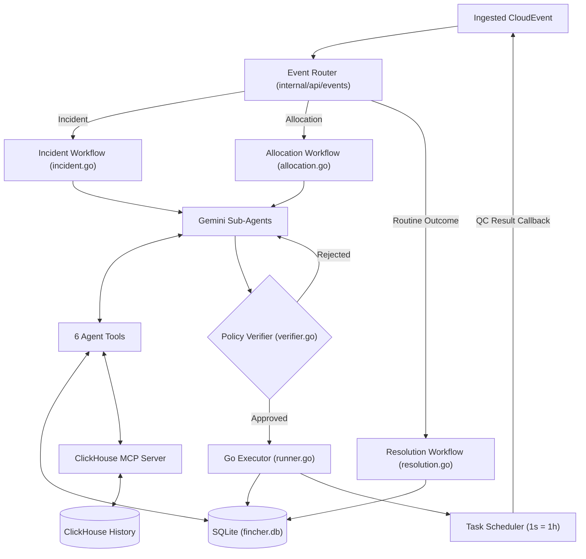

# Fincher

**Live Deployment**: [https://fincher.elliot14a.work](https://fincher.elliot14a.work)

Autonomous operations engine for media post-production release pipelines.

Fincher catches supply chain defects (audio sync drift, revised cuts, SLA breaches, invalid QC packages), queries historical logs in ClickHouse via MCP, drafts recovery plans with Gemini 2.5, validates every action through a deterministic Go policy engine, and executes state changes in a closed loop.

---

## Quick Start

### Prerequisites
- **Go 1.24+**
- **Docker & Docker Compose**
- **Bun** (for frontend)
- **Google Gemini API Key**

### 1. Setup Environment
```bash
cp .env.example .env
```
Edit `.env` and set `FINCHER_GEMINI_API_KEY`:
```dotenv
FINCHER_PORT=8080
FINCHER_TURSO_URL=fincher.db
FINCHER_MCP_URL=http://127.0.0.1:8000/mcp
FINCHER_GEMINI_API_KEY=your_key_here
FINCHER_GEMINI_MODEL=gemini-2.5-flash
```

### 2. Start Databases
```bash
docker compose up -d
```
- ClickHouse HTTP: `http://localhost:8123`
- ClickHouse MCP Server: `http://localhost:8000`

### 3. Seed Initial Data
```bash
go run ./cmd/seed
```

### 4. Run Fincher
```bash
# Terminal 1: Backend
go run ./cmd/fincher

# Terminal 2: Frontend
cd web && bun install && bun dev
```

- **Operations Console**: `http://localhost:5173`
- **Backend Health**: `http://localhost:8080/health`
- **OpenAPI 3 Spec**: `http://localhost:8080/openapi.json`

---

## Core Invariants

1. **Read-Only AI Agents**: LLMs never mutate state or write SQL directly. Agents query SQLite and ClickHouse (via MCP) to produce structured proposals (`ActionPlan`).
2. **Deterministic Policy Gate**: All proposed actions must be approved by `verifier.go` before execution (enforces market isolation, vendor accuracy ≥ 90%, and premiere deadline buffers).
3. **Time-Compressed Clock**: The internal scheduler operates on a compressed clock where **1 real second = 1 operational hour** (`timeScale = 1s`). An 8-hour vendor turnaround finishes in 8 seconds, enabling realistic, rapid live-testing.
4. **Closed-Loop Execution**: State changes trigger simulated QC turnaround tasks. Passing QC automatically releases deliveries and updates title status to `ON_TRACK`.
5. **Full Telemetry**: Every run, tool call, reasoning step, and judge verdict is written to SQLite (`runs`, `steps`, `wf_results`) and streamed live over SSE (`/api/events/stream`).

---

## System Architecture



### Services

| Service | Technology | Role |
| :--- | :--- | :--- |
| **Backend** | Go 1.24 / Echo | REST API, OpenAPI contract, SSE stream, graph execution |
| **Analytics DB** | ClickHouse 24.3 | Historical CloudEvents, QC inspection logs, vendor defect metrics |
| **MCP Server** | `@clickhouse/mcp-clickhouse` | Official Model Context Protocol HTTP interface for analytical queries |
| **State DB** | SQLite / Turso | Media catalog titles, packages, deliveries, vendors, and audit runs |
| **LLM Runtime** | Gemini 2.5 Flash / Google ADK | Triage judge, action planner, vendor selector, operations chat |
| **In-Memory Scheduler** | `internal/scheduler` | Time-compressed task scheduler (1 second = 1 operational hour) |
| **Frontend** | Preact + Vite + TanStack | Real-time operations UI with territory matrix & lineage DAG |

---

## Workflows

All workflows run asynchronously with panic recovery and 5-minute timeouts (`internal/agent/graph/`).

```mermaid
flowchart TD
    subgraph WFA ["Workflow A: Incident Graph (incident.go)"]
        A1["1. Triage Judge (filter.go)"] --> A2["2. Context Gathering (impact, analytics, projection)"]
        A2 --> A3["3. Remediation Loop (planner_agent.go + verifier.go)"]
        A3 --> A4["4. Go Executor (runner.go)"]
    end

    subgraph WFB ["Workflow B: Allocation Graph (allocation.go)"]
        B1["1. Candidate Gathering"] --> B2["2. Vendor Selection (selector_agent.go)"]
        B2 --> B3["3. Provisioning (allocation_executor.go)"]
    end

    subgraph WFC ["Workflow C: Resolution Graph (resolution.go)"]
        C1["1. Mark Package VALID"] --> C2["2. 1:N Delivery Resolution (Video + Audio + Subtitle VALID)"]
        C2 --> C3["3. Title Self-Heal (HOLD / PROCESSING / ON_TRACK)"]
    end
```



### 1. Incident Workflow (`incident.go`)
Triggered by audio sync drift, revised cuts, SLA breaches, or QC failures.
- **Triage Judge** (`filter.go`): Evaluates severity and actionability.
- **Context Gathering** (`impact.go`, `analytics.go`, `projection.go`): Computes blast radius, affected markets, and premiere countdown.
- **Remediation Loop** (`planner_agent.go` + `verifier.go`): Proposes vendor reassignments and delivery holds; retries up to 3 times on policy rejection before escalating.
- **Executor** (`runner.go`): Mutates SQLite state, emits downstream events, and schedules re-QC.

### 2. Allocation Workflow (`allocation.go`)
Triggered when new packages or localized assets are required.
- **Candidate Gathering**: Identifies required components and target markets.
- **Vendor Selection** (`selector_agent.go`): Two-phase tool querying to select vendors based on accuracy, turnaround, and cost.
- **Provisioning** (`allocation_executor.go`): Creates pending packages, puts deliveries on hold, and schedules QC.

### 3. Resolution Workflow (`resolution.go`)
Deterministic, non-LLM self-healing triggered when re-QC passes (`fincher.qc.completed` with `status: PASSED`).
- Sets package status to `VALID`.
- Multi-package matching: releases delivery from `HOLD` to `READY_TO_SHIP` only when Video, Audio, and Subtitle are all `VALID`.
- Self-heals title status: `HOLD` if unresolved defects exist, `PROCESSING` if pending, `ON_TRACK` when ready.
- Emits `fincher.delivery.released` to ClickHouse.

---

## The 6 Agent Tools

| Tool | Source | Purpose |
| :--- | :--- | :--- |
| `query_turso` | SQLite | Read-only SQL query against operational tables (capped at 100 rows, write/DDL blocked). |
| `query_clickhouse` | ClickHouse MCP | Read-only SQL query against historical events, QC logs, and vendor metrics. |
| `query_analytics` | Typed Tool | Computes recency-weighted vendor accuracy and defect rates from ClickHouse. |
| `get_delivery_impact` | Typed Tool | Calculates affected packages, downstream territories, and hours until premiere. |
| `get_vendor_candidates` | Typed Tool | Finds active vendors by component/market and enriches with accuracy stats. |
| `get_title_ready_projection` | Typed Tool | Calculates repair turnaround vs premiere deadline and assigns risk band (`SAFE`, `WATCH`, `TIGHT`, `BREACH`). |

---

## Policy Engine Rules (`verifier.go`)

Every plan must pass all rules before execution:
1. **Accuracy Floor**: Vendor accuracy must be ≥ 90% (`VendorAccuracyFloor = 0.90`).
2. **Market Isolation**: Remediation actions must only touch deliveries for the affected language/territory.
3. **Turnaround Limits**: Vendor turnaround must fit within the premiere countdown (or plan must include `HOLD_TITLE`/`NOTIFY_STAKEHOLDERS`).
4. **Release Gate**: Deliveries cannot be released if any associated component package is invalid.
5. **Target Integrity**: Target IDs must exist; delivery actions cannot target package IDs.
6. **Retry Cap**: Max 3 remediation attempts before escalating to a human operator (`RunStatusEscalated`).

---

## Testing & Simulating the Flows

### 1. Interactive Simulation UI (`/simulate`)
The web console includes a dedicated **Simulate Page** (`http://localhost:5173/simulate` or `https://fincher.elliot14a.work/simulate`) to test workflows live:
- **Master Cut Revision**: Simulates editorial cut bumps, invalidating stale downstream packages.
- **Audio Sync Drift**: Simulates audio timing drift (>120ms) and tests vendor reassignment.
- **Vendor SLA Breach**: Simulates vendor delivery failures and emergency reassignment.
- **Custom Event Emitter**: Send arbitrary CloudEvent JSON payloads directly to the ingestion engine.

### 2. End-to-End Walkthrough: Title Creation & Allocation Flow
Test the full lifecycle from title onboarding to automatic vendor assignment, QC turnaround, and delivery release:

1. **Create Title**: Go to `http://localhost:5173/titles` &rarr; Click **"New Title"** (or use `POST /api/titles`).
2. **Trigger Allocation**: Ingestion emits `fincher.title.created` and launches **Workflow B (Allocation)**.
3. **Vendor Selection**: The agent queries SQLite via `query_turso`, selects the best vendors for Video, Audio, and Subtitles, creates Package rows (`PENDING`), and puts Deliveries on `HOLD`.
4. **Simulated QC Turnaround**: Tasks are scheduled in the Scheduler. Because **1 second = 1 operational hour**, a 10-hour turnaround waits 10 seconds.
5. **Auto-Resolution**: Once turnaround finishes, the QC callback fires `fincher.qc.completed` (`status: PASSED`).
6. **Delivery Release**: **Workflow C (Resolution)** verifies all required packages (Video + Audio + Subtitle) are valid, auto-releases deliveries to `READY_TO_SHIP`, and sets the title status to `ON_TRACK`.

### 3. API Anomaly Testing via cURL

#### Trigger Audio Sync Drift Incident
```bash
curl -X POST http://localhost:8080/api/events \
  -H "Content-Type: application/json" \
  -d '{
    "type": "fincher.audio.sync_drift",
    "source": "qc.audio.analyzer",
    "subject": "solaris-2026",
    "severity": "WARN",
    "data": {
      "package_id": "pkg-solaris-de-audio",
      "title_slug": "solaris-2026",
      "component": "AUDIO",
      "language": "de-DE",
      "sync_drift_ms": 135.0,
      "vendor_id": "vnd-berlin-sound"
    }
  }'
```

#### Trigger Master Cut Revision
```bash
curl -X POST http://localhost:8080/api/events \
  -H "Content-Type: application/json" \
  -d '{
    "type": "fincher.master.cut.revised",
    "source": "editorial.avid",
    "subject": "solaris-2026",
    "severity": "CRITICAL",
    "data": {
      "title_slug": "solaris-2026",
      "new_master_version": "v2.0",
      "supersedes_version": "v1.0",
      "cut_duration_seconds": 7420
    }
  }'
```

#### Ask Operations Chat Assistant
```bash
curl -X POST http://localhost:8080/api/chat \
  -H "Content-Type: application/json" \
  -d '{
    "query": "Why was the German audio delivery held for Solaris?"
  }'
```

---

## Project Structure

```text
fincher/
├── cmd/
│   ├── fincher/          # Unified server binary (API, Orchestrator, SSE, UI)
│   └── seed/             # SQLite & ClickHouse historical data generator
├── internal/
│   ├── agent/            # Sub-agents, tools, verifier, and runner
│   │   ├── graph/        # Graphs: incident.go, allocation.go, resolution.go, dispatch.go
│   │   └── tools/        # 6 agent tools (turso, clickhouse, analytics, impact, vendors, projection)
│   ├── api/              # REST routes (/api/titles, /deliveries, /packages, /events, /runs, /chat)
│   ├── clickhouse/       # ClickHouse connection & schema migrations
│   ├── turso/            # SQLite connection & Ent ORM client
│   └── scheduler/        # In-memory time-scaled QC task scheduler (1s = 1h)
├── pkg/
│   ├── domain/models/    # Domain models & CloudEvent taxonomy
│   └── mcp/              # ClickHouse MCP HTTP client
├── openapi/              # OpenAPI 3 specification (swagger.json)
├── web/                  # Preact frontend (Vite, TanStack Router/Query/Table, Vanilla Extract)
├── docker-compose.yml    # ClickHouse & ClickHouse MCP services
└── Justfile              # Developer automation recipes
```

---

## License

MIT

